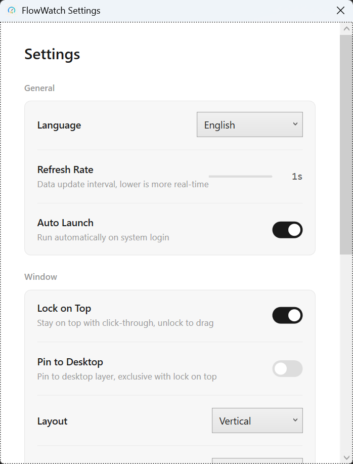
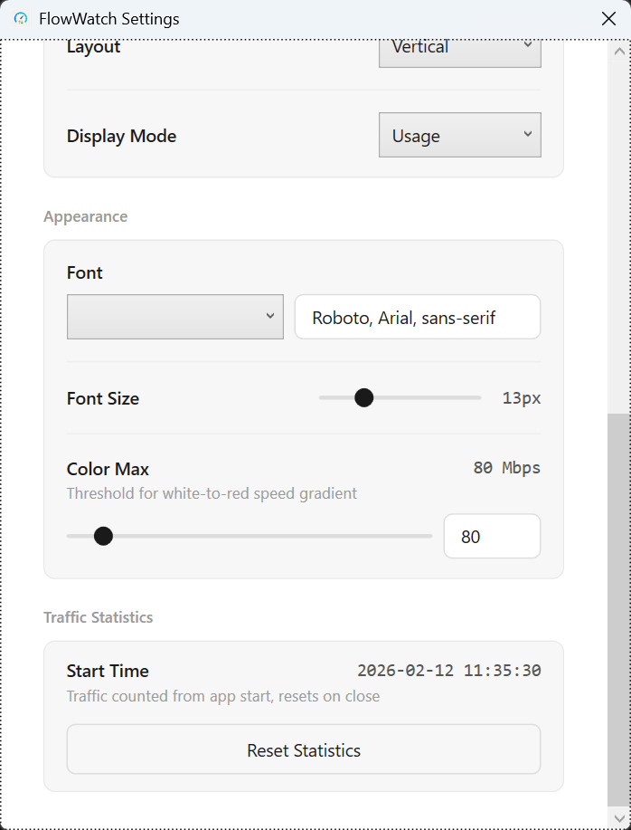
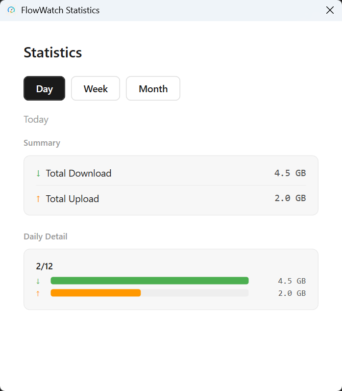
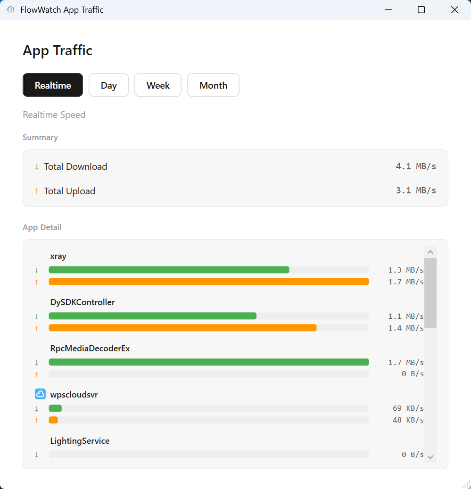
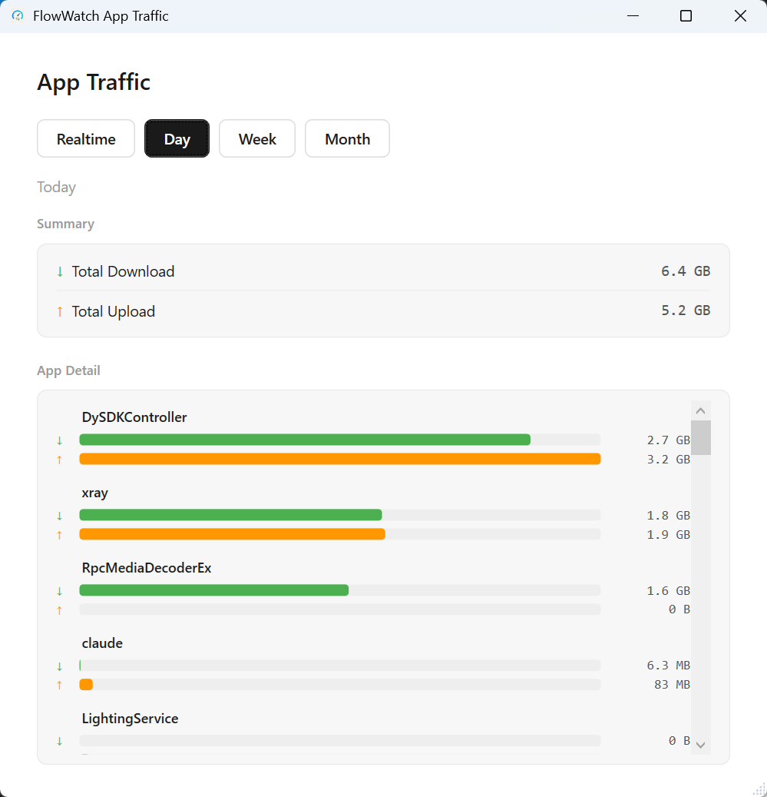

# FlowWatch

A lightweight, transparent overlay network speed monitor for Windows. Displays real-time upload/download speeds on your desktop with per-app traffic tracking and historical statistics.

Built with C# WPF (.NET Framework 4.8), ~5 MB binary, <50 MB memory usage.

**English | [中文](README.md)**

---

## Screenshots

<table>
<tr>
<td align="center"><b>Settings — General</b></td>
<td align="center"><b>Settings — Appearance</b></td>
</tr>
<tr>
<td></td>
<td></td>
</tr>
</table>

<table>
<tr>
<td align="center"><b>Traffic Statistics</b></td>
<td align="center"><b>App Traffic (Realtime)</b></td>
<td align="center"><b>App Traffic (Daily)</b></td>
</tr>
<tr>
<td></td>
<td></td>
<td></td>
</tr>
</table>

## Features

- **Real-time overlay** — Transparent floating window showing upload/download speeds with color-coded gradients
- **Per-app traffic monitoring** — Track network usage by process with ETW (Event Tracing for Windows), view realtime speeds or daily/weekly/monthly totals
- **Traffic statistics** — Daily/weekly/monthly traffic history with bar charts, data retained for 90 days
- **System tray** — Right-click menu for quick access to Settings, Statistics, App Traffic, Pin/Lock, and Exit
- **Lock on Top** — Pin the overlay on top with click-through; unlock to drag and reposition
- **Pin to Desktop** — Attach the overlay to the desktop layer (stays visible on Show Desktop), mutually exclusive with Lock on Top
- **Layout** — Horizontal or vertical arrangement for screen edge placement
- **Display modes** — Speed only, usage only, or speed + usage combined
- **Appearance** — Customizable font family, font size (11–19px), and speed color gradient threshold (1–1000 Mbps)
- **Auto launch** — Starts on login via Windows Task Scheduler (runs elevated)
- **Language** — English, Chinese, or auto-detect from system locale
- **Single instance** — Prevents duplicate launches

## Requirements

- Windows 10 or later (x64)
- **Administrator privileges** required for per-app traffic monitoring (ETW kernel events)

## Installation

Download the latest ZIP from [Releases](../../releases), extract, and run `FlowWatch.exe`.

## Build from Source

Requires Visual Studio 2019+ or MSBuild + NuGet CLI.

```bash
cd FlowWatch.Windows
nuget restore FlowWatch.sln
msbuild FlowWatch.sln /p:Configuration=Release /p:Platform=x64
```

Or use the build script to produce a distributable ZIP:

```powershell
cd FlowWatch.Windows
.\build.ps1 -Version 1.0.0
```

Output: `FlowWatch.Windows\FlowWatch\bin\x64\Release\`

## Project Structure

```
FlowWatch.Windows/
├── FlowWatch.sln
├── build.ps1 / build.bat
└── FlowWatch/
    ├── App.xaml(.cs)              # Entry point, tray icon, single instance
    ├── Services/
    │   ├── NetworkMonitorService  # System-wide speed polling
    │   ├── ProcessTrafficService  # Per-app ETW traffic capture
    │   ├── TrafficHistoryService  # Daily traffic persistence
    │   ├── SettingsService        # JSON settings (atomic write)
    │   ├── LocalizationService    # i18n (EN/ZH dynamic switch)
    │   ├── DesktopPinService      # Pin overlay to desktop layer
    │   └── AutoLaunchService      # Task Scheduler auto-start
    ├── ViewModels/                # MVVM data binding
    ├── Views/
    │   ├── OverlayWindow          # Floating speed display
    │   ├── SettingsWindow         # Configuration UI
    │   ├── StatisticsWindow       # Traffic history charts
    │   └── AppTrafficWindow       # Per-app traffic details
    ├── Models/                    # Data models
    ├── Helpers/                   # Win32 interop, formatting, color gradient
    └── Resources/
        ├── Styles/                # WPF styles
        └── Strings/               # en-US.xaml, zh-CN.xaml
```

## Configuration

Settings are stored at `%LOCALAPPDATA%\FlowWatch\settings.json`.

| Setting | Default | Description |
|---------|---------|-------------|
| Language | auto | `auto` / `en` / `zh` |
| RefreshInterval | 1000 ms | Data polling interval (1–10s) |
| LockOnTop | true | Lock overlay on top with click-through |
| PinToDesktop | false | Pin to desktop layer (exclusive with LockOnTop) |
| AutoLaunch | true | Start on system login |
| Layout | horizontal | `horizontal` / `vertical` |
| DisplayMode | speed | `speed` / `usage` / `both` |
| FontFamily | Segoe UI, Microsoft YaHei | Custom font stack |
| FontSize | 18 | Overlay font size (11–19px) |
| SpeedColorMaxMbps | 100 | White-to-red gradient threshold |
