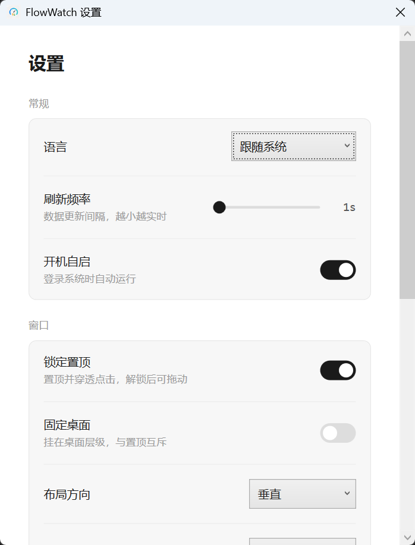
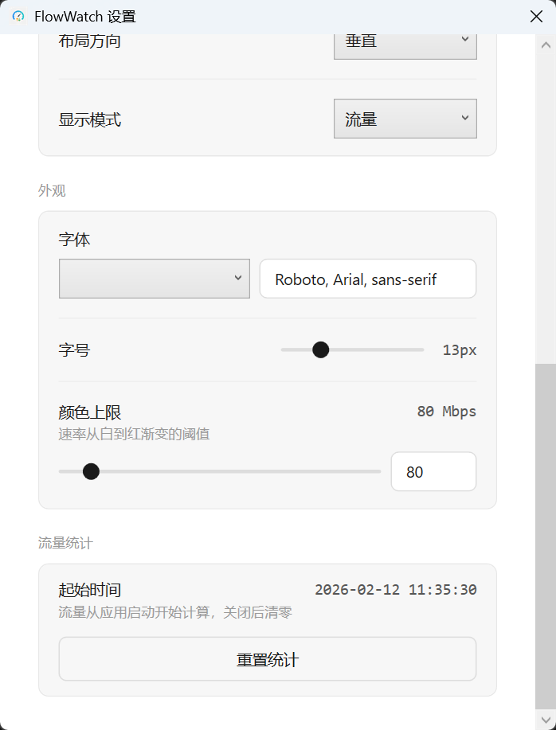
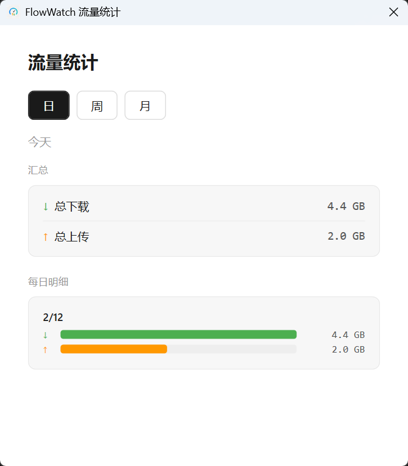
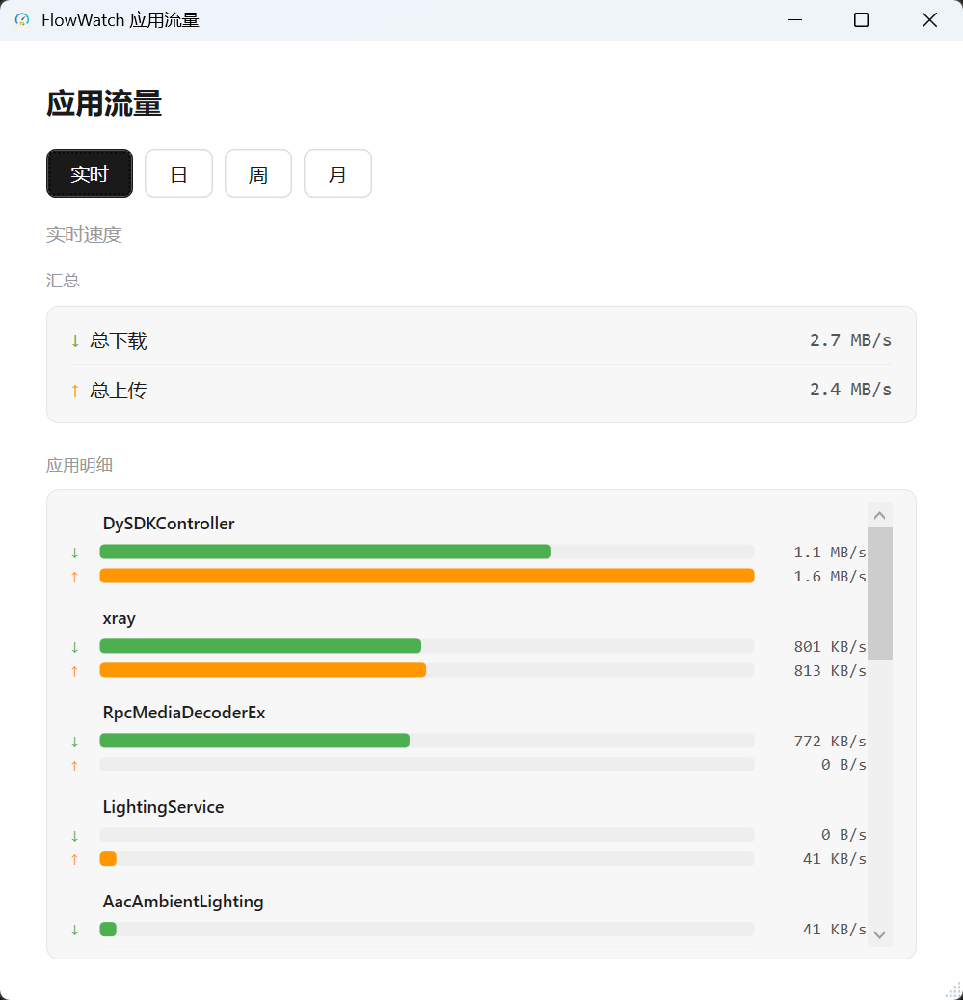
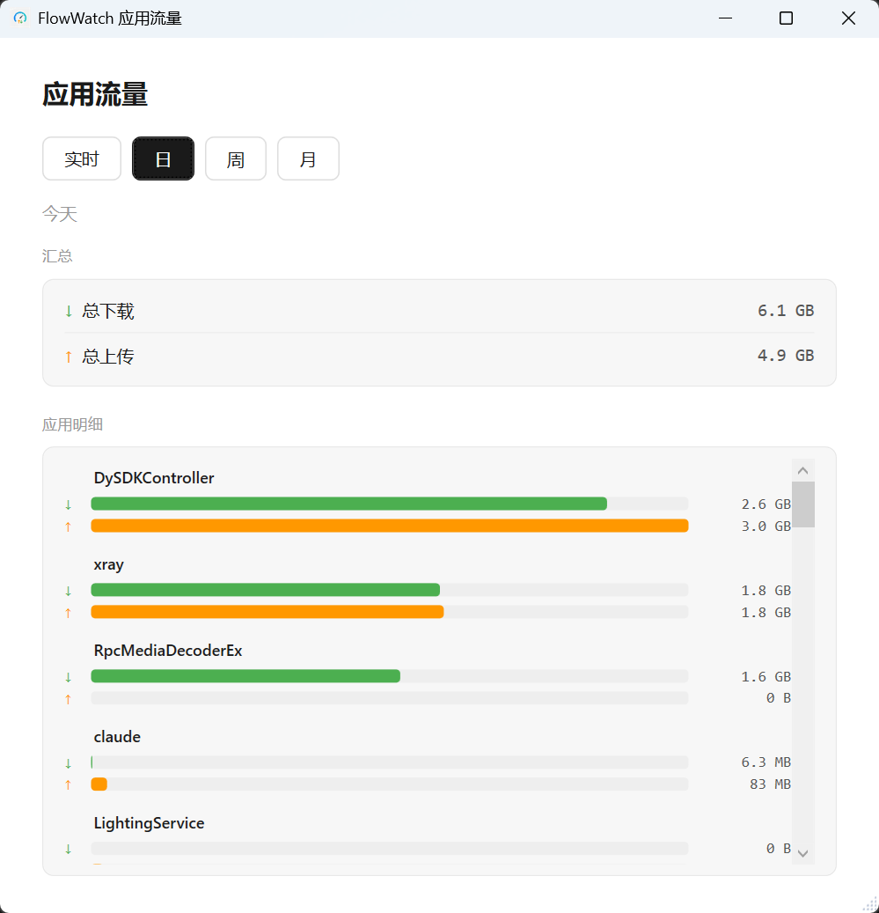

# FlowWatch

轻量级透明悬浮网速监控工具，支持按应用流量监控和历史流量统计。

基于 C# WPF (.NET Framework 4.8) 构建，~5 MB 体积，<50 MB 内存占用。

**[English](README.en.md) | 中文**

---

## 截图

<table>
<tr>
<td align="center"><b>设置 — 常规</b></td>
<td align="center"><b>设置 — 外观</b></td>
</tr>
<tr>
<td></td>
<td></td>
</tr>
</table>

<table>
<tr>
<td align="center"><b>流量统计</b></td>
<td align="center"><b>应用流量（实时）</b></td>
<td align="center"><b>应用流量（按日）</b></td>
</tr>
<tr>
<td></td>
<td></td>
<td></td>
</tr>
</table>

## 功能

- **实时悬浮窗** — 透明悬浮窗显示实时上传/下载网速，颜色渐变指示速率
- **按应用流量监控** — 基于 ETW 内核事件追踪各进程网络使用，支持实时速度/日/周/月视图
- **流量统计** — 日/周/月流量历史柱状图，数据保留 90 天
- **系统托盘** — 右键菜单：设置、流量统计、应用流量、置顶、自动隐藏、退出
- **锁定置顶** — 置顶并穿透点击，解锁后可拖动
- **悬停显示** — 鼠标离开时悬浮窗淡化至 10% 透明度，悬停时恢复显示，可与置顶同时使用
- **布局** — 横向/纵向两种排布
- **显示模式** — 速率 / 流量 / 速率+流量
- **外观** — 自定义字体、字号（11–19px）、颜色渐变上限（1–1000 Mbps）
- **开机自启** — 通过 Windows 任务计划程序以管理员权限自启
- **语言切换** — 中文、英文、跟随系统，运行时即时切换
- **应用内更新** — 自动检查 GitHub Releases 新版本，支持下载安装、跳过版本、稍后提醒（24 小时检查间隔）
- **单实例运行** — 避免重复启动

## 其他平台

- **macOS 版本**：[FlowWatch for Mac](https://github.com/huangxida/FlowWatch)

## 系统要求

- Windows 10 或更高版本（x64）
- **需要管理员权限**（ETW 内核事件监控需要）

## 安装

从 [Releases](../../releases) 下载最新 ZIP，解压后运行 `FlowWatch.exe`。

## 从源码构建

需要 Visual Studio 2019+ 或 MSBuild + NuGet CLI。

```bash
cd FlowWatch.Windows
nuget restore FlowWatch.sln
msbuild FlowWatch.sln /p:Configuration=Release /p:Platform=x64
```

或使用构建脚本生成可分发 ZIP：

```powershell
cd FlowWatch.Windows
.\build.ps1 -Version 1.0.0
```

输出目录：`FlowWatch.Windows\FlowWatch\bin\x64\Release\`

## 项目结构

```
FlowWatch.Windows/
├── FlowWatch.sln
├── build.ps1 / build.bat
└── FlowWatch/
    ├── App.xaml(.cs)              # 入口、托盘图标、单实例
    ├── Services/
    │   ├── NetworkMonitorService  # 系统网速轮询
    │   ├── ProcessTrafficService  # 按应用 ETW 流量采集
    │   ├── TrafficHistoryService  # 每日流量持久化
    │   ├── SettingsService        # JSON 设置（原子写入）
    │   ├── UpdateService          # 应用内自动更新（GitHub Releases）
    │   ├── LocalizationService    # 国际化（中/英动态切换）
    │   └── AutoLaunchService      # 任务计划程序自启
    ├── ViewModels/                # MVVM 数据绑定
    ├── Views/
    │   ├── OverlayWindow          # 悬浮网速显示
    │   ├── SettingsWindow         # 设置界面
    │   ├── StatisticsWindow       # 流量统计图表
    │   ├── AppTrafficWindow       # 按应用流量详情
    │   └── UpdateWindow           # 版本更新界面
    ├── Models/                    # 数据模型
    ├── Helpers/                   # Win32 互操作、格式化、颜色渐变
    └── Resources/
        ├── Styles/                # WPF 样式
        └── Strings/               # en-US.xaml, zh-CN.xaml
```

## 配置

设置保存在 `%LOCALAPPDATA%\FlowWatch\settings.json`。

| 设置项 | 默认值 | 说明 |
|--------|--------|------|
| Language | auto | `auto` / `en` / `zh` |
| RefreshInterval | 1000 ms | 数据轮询间隔（1–10 秒） |
| LockOnTop | true | 锁定置顶并穿透点击 |
| AutoHide | false | 悬停显示（鼠标离开淡化，悬停恢复） |
| AutoLaunch | true | 开机自启 |
| Layout | horizontal | `horizontal` / `vertical` |
| DisplayMode | speed | `speed` / `usage` / `both` |
| FontFamily | Segoe UI, Microsoft YaHei | 自定义字体栈 |
| FontSize | 18 | 悬浮窗字号（11–19px） |
| SpeedColorMaxMbps | 100 | 白到红渐变阈值 |
| AutoCheckUpdate | true | 自动检查更新（24 小时间隔） |
| SkippedVersion | — | 用户选择跳过的版本号 |
